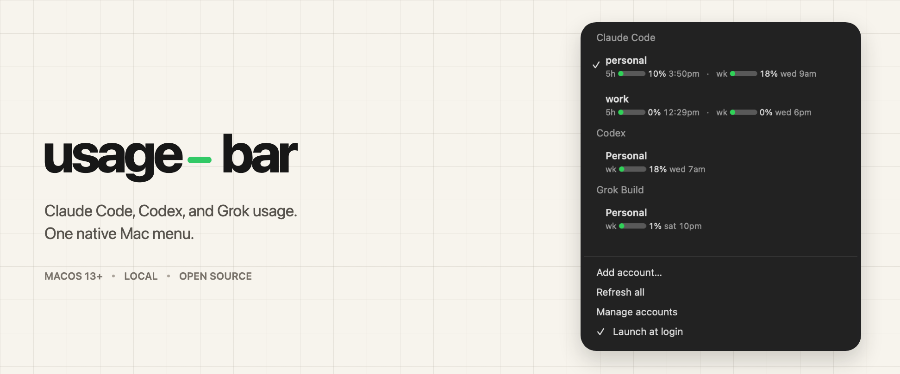
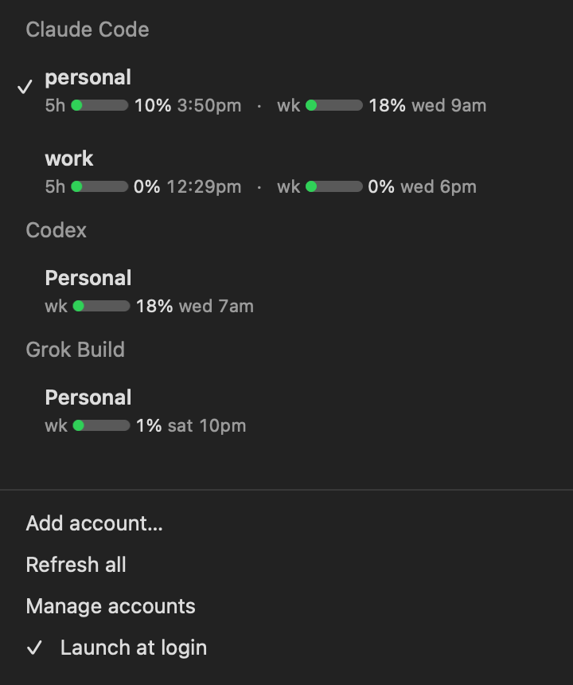

<p align="center">
  
</p>

**Usage Bar** keeps Claude Code, Codex, Grok Build, and Kimi Code limits in one native macOS menu. The system bar stays compact; open the menu for every account and provider.

<p align="center">
  <a href="https://github.com/johnkueh/usage-bar/releases/latest/download/Usage-Bar.dmg"><strong>Download for Mac</strong></a>
  · macOS 13+ · Apple Silicon and Intel · MIT
</p>

## Capabilities

- **Four providers, one menu.** Claude Code shows its 5-hour and weekly windows, Codex shows every window its CLI returns, Grok Build shows its weekly limit, and Kimi Code shows its quota windows.
- **Claude account switching.** Save multiple Anthropic logins and click a Claude row to switch. Only the active Claude account gets a checkmark.
- **Usage-only Codex, Grok, and Kimi accounts.** Add the current CLI login or sign in to another isolated account. Usage Bar reads their limits without changing which account either CLI uses.
- **Native and quiet.** AppKit menu, automatic light and dark mode, five-minute refreshes, wake refreshes, and no Dock icon.
- **Updates in place.** Usage Bar checks daily for signed updates and can install them without another drag-and-drop install.
- **No autopilot.** Usage Bar never switches accounts on its own.
- **Local by default.** Account names and CLI-home paths stay on your Mac. Provider credentials remain in the files and Keychain entries their CLIs already manage.

<p align="center">
  
</p>

## Install

1. [Download the latest DMG](https://github.com/johnkueh/usage-bar/releases/latest/download/Usage-Bar.dmg).
2. Open the disk image and drag **Usage Bar** into **Applications** (don’t leave it on the disk image).
3. Open **Usage Bar** from Applications.
4. Look in the **menu bar** at the top-right of the screen — there is **no Dock icon**. First launch shows a **Usage** label and a short welcome dialog.
5. Click **Usage**, then **Add account…** to connect Claude Code, Codex, Grok, or Kimi.

The downloaded app is Developer ID signed and notarized by Apple. Usage Bar itself has no package-manager dependencies. Install the Claude Code, Codex, Grok, or Kimi CLI only for the providers you want to monitor.

## Accounts

Claude accounts use credential snapshots in `~/.claude`. Running Claude sessions keep their existing credential when you switch; new sessions and agents use the selected account.

Codex, Grok, and Kimi accounts authenticate inside their existing `CODEX_HOME`, `GROK_HOME`, or `KIMI_HOME`. Usage Bar stores only account names and home paths in `~/.usage-bar/accounts.json`; it never copies rotating refresh tokens between accounts.

Removing Codex, Grok, or Kimi from Usage Bar leaves the CLI login files alone. Removing a Claude account deletes that account's local credential snapshot.

## Refresh behavior

Usage refreshes every five minutes, when the menu opens, after wake, and with ⌘R. If a provider cannot refresh, Usage Bar keeps the last good value and marks it as stale.

- Claude reads Anthropic's OAuth usage endpoint and refreshes expired inactive snapshots in the background.
- Codex uses the official `codex app-server` `account/rateLimits/read` method.
- Grok opens its built-in `/usage show` view in a private pseudo-terminal and reads the weekly meter.
- Kimi reads the official Kimi Code `/usages` API with the OAuth token or API key the CLI already stores.

## App updates

Usage Bar checks for updates once a day. To check immediately, open its menu and choose **Check for Updates…**. When a release is available, Usage Bar downloads it, verifies its Sparkle signature, replaces the installed app, and relaunches.

Versions older than the first Sparkle-enabled release still need one final manual update: download the latest DMG, replace Usage Bar in Applications, and open it again. Later releases update in place.

## Build from source

```sh
git clone https://github.com/johnkueh/usage-bar
cd usage-bar
./install.sh
```

Building requires macOS 13+ and the Xcode command line tools. `./build.sh` creates a universal app; set `INSTALL=0` to leave it in `build/` without replacing the installed copy.

## Release

`./release.sh --dry-run` exercises the universal build, signing, DMG, Sparkle signature, and appcast chain locally. `./release.sh --set-version 2.0.2` increments the build number and creates a real release. It reads Apple notarization credentials and the exported Sparkle EdDSA key path from an untracked `release.env`, signs with Developer ID, notarizes and staples both app and DMG, and writes the versioned DMG, stable DMG, and `appcast.xml` to `dist/`. Upload all three files to the matching GitHub release; installed copies read the appcast and stable DMG from the latest release assets.

## Privacy

Usage Bar has no server, analytics, or account database. It calls provider-owned endpoints or CLIs from your Mac and caches the last successful usage response in macOS preferences. Credentials are never sent anywhere except their provider.

MIT.
